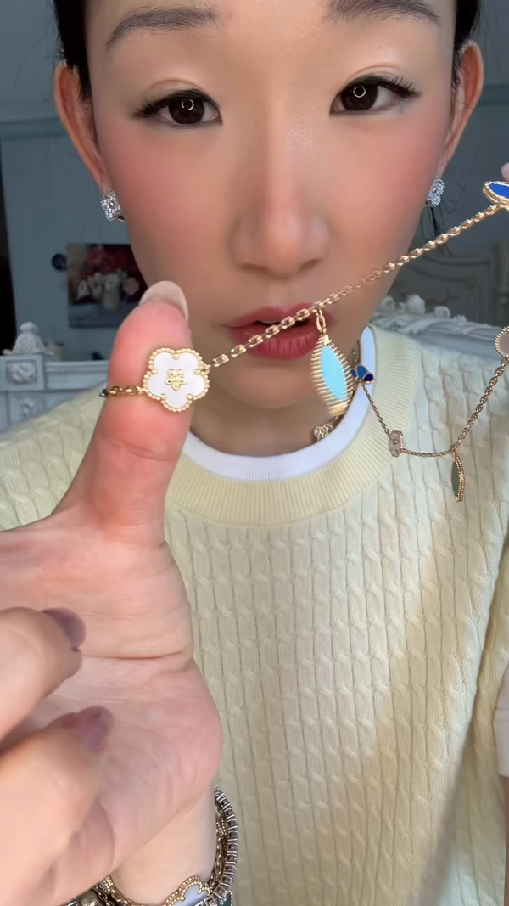
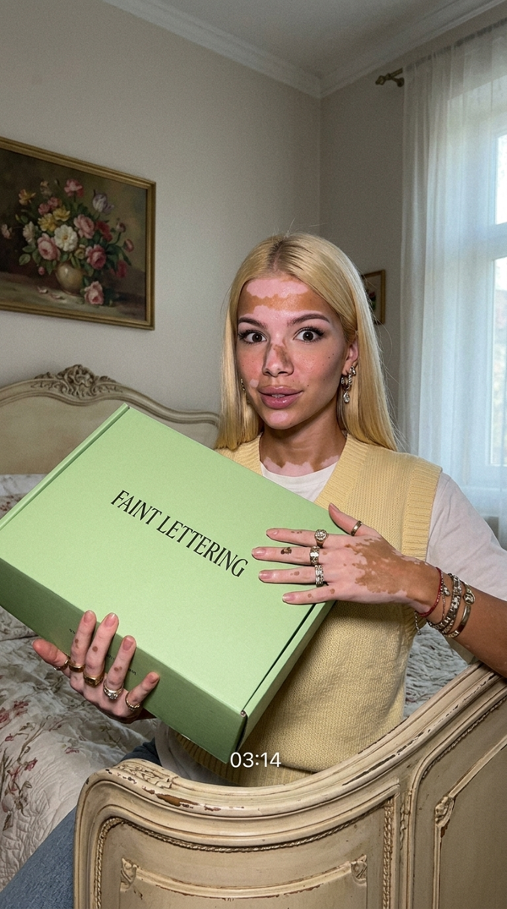
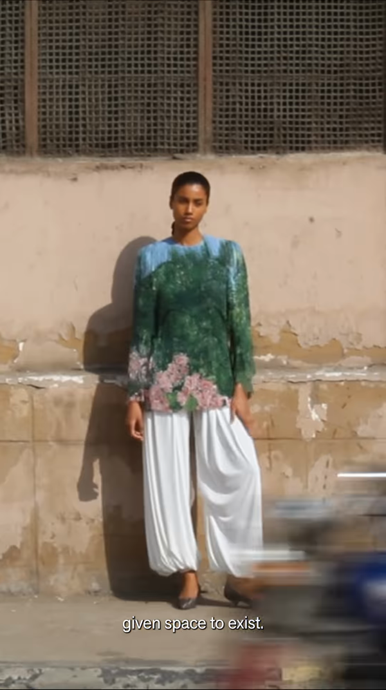
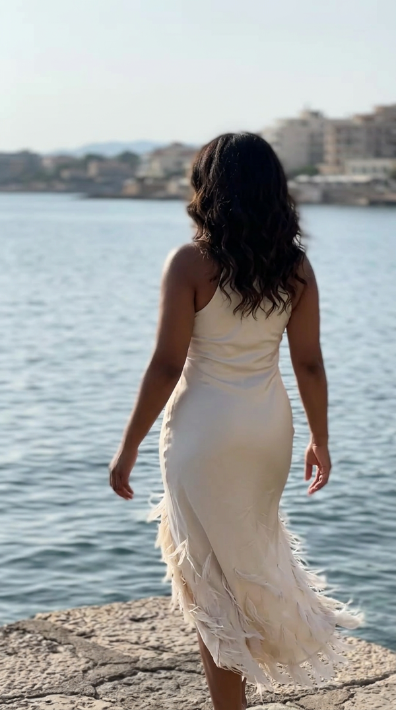
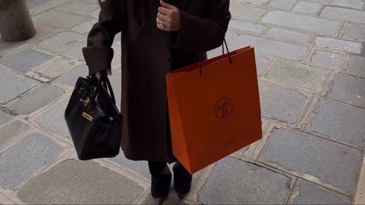
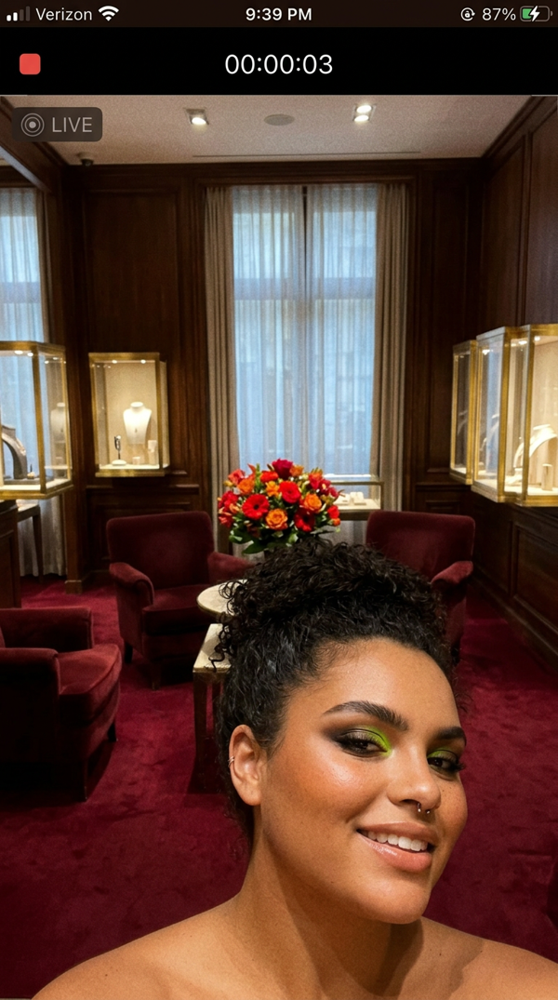

# Bloggers Factory

AI-powered Instagram carousel and reel-to-video generator. Scrapes real blogger posts and reels for inspiration, generates image prompts via GPT-4o, produces photorealistic carousel images using fal.ai's Nano Banana 2 model with reference face images, and creates AI videos from reels using Kling.

## How It Works

### Carousel pipeline

```
Instagram post (caption + image)
        |
        v
   GPT-4o analyzes the vibe, pose, outfit, setting
        |
        v
   Generates N image prompts per carousel
        |
        v
   fal.ai Nano Banana 2 renders each prompt
   using reference face images for consistency
        |
        v
   Downloads images + saves metadata to output/
```

### Reel-to-video pipeline

```
Instagram reel (or direct URL)
        |
        v
   Download reel via yt-dlp, extract key frames
        |
        v
   GPT-4o generates a scene prompt from the first frame
        |
        v
   Nano Banana 2 recreates the scene with AI model identity
        |
        v
   Vision model (Gemini) analyzes motion across frames
        |
        v
   Kling generates a video from the image + motion prompt
        |
        v
   Downloads video + saves metadata to output/
```

## Setup

1. **Install dependencies:**

```bash
pip install -r requirements.txt
```

2. **Create a `.env` file** with your API keys:

```
RAPID_API_KEY=your_rapidapi_key
OPENAI_API_KEY=your_openai_key
FAL_AI_API_KEY=your_fal_ai_key
```

3. **Add reference images** for each AI model in `ai_models/<ModelName>/` (JPG/PNG face photos).

4. **Configure models** in `config.json` -- map each model to an Instagram blogger and a reference image directory.

## Usage

### Single carousel

Generate one carousel for a specific model:

```bash
python generate.py --model Andrea
```

### Bulk generation

Generate many carousels per model with resume support:

```bash
# Sequential (one model at a time)
python generate.py --bulk --min-carousels 60

# Single model only
python generate.py --bulk --model Andrea --min-carousels 60

# Parallel (multiple models at once)
python generate.py --bulk --parallel --workers 4
```

### Single reel-to-video

Generate one AI video inspired by a blogger's reel:

```bash
# Fetch a random reel from the model's blogger
python generate.py --reel --model Andrea

# Use a specific reel URL
python generate.py --reel --model Andrea --reel-source https://...

# Customize video duration and vision model
python generate.py --reel --model Andrea --duration 10 --vision-model google/gemini-2.5-flash
```

### Bulk reel generation

Generate many reel-to-video conversions per model with resume support:

```bash
# Sequential, all models
python generate.py --reel --bulk --min-reels 10

# Single model only
python generate.py --reel --bulk --model Andrea --min-reels 10

# Parallel
python generate.py --reel --bulk --parallel --workers 4
```

### Cron mode

Generate one carousel per model for all models (daily automation):

```bash
python generate.py --cron
```

### Check progress

```bash
python generate.py --status
```

### Reset state

```bash
# Reset one model
python generate.py --reset --model Andrea

# Reset all
python generate.py --reset
```

### All options

| Flag | Description |
|---|---|
| `--model NAME` | Run for a single model |
| `--bulk` | Bulk mode with resume state |
| `--parallel` | Process models concurrently (bulk mode) |
| `--workers N` | Number of parallel model workers (default: 4) |
| `--min-carousels N` | Target carousels per model (default: 60) |
| `--min-reels N` | Target reels per model in bulk reel mode (default: 10) |
| `--config PATH` | Config file path (default: `config.json`) |
| `--verbose` | Enable debug logging |
| `--status` | Show progress summary and exit |
| `--reset` | Reset generation state |
| `--cron` | One carousel per model, all models |
| `--reel` | Reel-to-video mode |
| `--reel-source URL` | Direct reel path/URL (omit to fetch from blogger) |
| `--duration N` | Kling video duration in seconds (default: 5) |
| `--vision-model MODEL` | Vision model for motion analysis (default: `google/gemini-2.5-flash`) |

## Real Examples

### Reel-to-video pipeline

Each run scrapes a real blogger reel, analyzes it with GPT-4o and Gemini, and generates a new AI video. Here are three real outputs from the pipeline.

---

### Example 1: Andrea (source: @beccaxbloom)

**Source reel frame** &#8594; **AI-generated image (Nano Banana 2)**

<p>


</p>

**Source reel** &#8594; **AI-generated video (Kling)**

<table>
<tr>
<td><b>Source reel</b></td>
<td><b>AI video</b></td>
</tr>
<tr>
<td><video src="https://github.com/Kakoedlinnoeslovo/bloggers_factory/raw/main/docs/examples/andrea/source_reel.mp4" width="280" controls></video></td>
<td><video src="https://github.com/Kakoedlinnoeslovo/bloggers_factory/raw/main/docs/examples/andrea/ai_video.mp4" width="280" controls></video></td>
</tr>
</table>

<details>
<summary>Generated prompts</summary>

**Scene prompt** (GPT-4o):
> A young woman is captured in a casual phone camera screenshot, sitting on a vintage-style bed with intricate carvings. She holds a large, light green box labeled with faint lettering, using both hands to present it excitedly. Her expression is animated with wide eyes and a slight smile. She wears a light yellow sleeveless knit over a white shirt, adorned with several rings, bracelets, and earrings that catch the light. The setting is cozy, with a painting of flowers on the wall and ambient natural lighting creating soft shadows.

**Kling prompt** (Gemini):
> A young Asian woman, with a clean bun and elegant makeup, wearing a light yellow cable-knit vest over a white t-shirt, gently and smoothly lowers a large light green box onto her lap, smiling warmly at the camera. She then gradually brings her hands up, delicately holding and displaying an intricate gold necklace with multiple charms, including a white floral one, moving it closer to the camera to highlight its details. Her fingers gracefully manipulate the jewelry. She slowly and fluidly lowers the necklace, which is now elegantly draped around her neck, as she returns her gaze to the camera with a soft, content smile, her movements flowing effortlessly from one pose to the next with subtle weight shifts.
</details>

---

### Example 2: amara (source: @imaanhammam)

**Source reel frame** &#8594; **AI-generated image (Nano Banana 2)**

<p>


</p>

**Source reel** &#8594; **AI-generated video (Kling)**

<table>
<tr>
<td><b>Source reel</b></td>
<td><b>AI video</b></td>
</tr>
<tr>
<td><video src="https://github.com/Kakoedlinnoeslovo/bloggers_factory/raw/main/docs/examples/amara/source_reel.mp4" width="280" controls></video></td>
<td><video src="https://github.com/Kakoedlinnoeslovo/bloggers_factory/raw/main/docs/examples/amara/ai_video.mp4" width="280" controls></video></td>
</tr>
</table>

<details>
<summary>Generated prompts</summary>

**Scene prompt** (GPT-4o):
> A casual phone video still captures a young woman standing on a rough stone platform by the water's edge. She is seen from behind, wearing a sleek, pale dress adorned with feather-like details at the hem, which sway gently in the breeze. Her posture is relaxed, arms resting naturally by her sides as she gazes towards the calm sea. The background reveals a distant shoreline with buildings, slightly blurred, suggesting a sunny day with bright, natural lighting.

**Kling prompt** (Gemini):
> A sophisticated female model standing gracefully beside a serene body of water under a clear sky. She is seen from behind, looking out over the calm expanse. The camera slowly and smoothly transitions into a gentle pull-back, revealing more of the water and distant cityscape, while she maintains her elegant, contemplative pose. Her white feathered dress gently sways with an imperceptible soft breeze, her posture remaining poised and still as the camera gradually widens its view, capturing the expansive, tranquil outdoor scene with fluid motion.
</details>

---

### Example 3: nola (source: @dianerrashid)

**Source reel frame** &#8594; **AI-generated image (Nano Banana 2)**

<p>


</p>

**Source reel** &#8594; **AI-generated video (Kling)**

<table>
<tr>
<td><b>Source reel</b></td>
<td><b>AI video</b></td>
</tr>
<tr>
<td><video src="https://github.com/Kakoedlinnoeslovo/bloggers_factory/raw/main/docs/examples/nola/source_reel.mp4" width="280" controls></video></td>
<td><video src="https://github.com/Kakoedlinnoeslovo/bloggers_factory/raw/main/docs/examples/nola/ai_video.mp4" width="280" controls></video></td>
</tr>
</table>

<details>
<summary>Generated prompts</summary>

**Scene prompt** (GPT-4o):
> This phone camera screenshot captures a cozy, elegant room with a warm, inviting atmosphere. The setting features rich, dark wood paneling and deep red carpeting that matches the plush armchairs. In the center, a table adorned with a vibrant bouquet of red and orange flowers adds a lively touch. Display cases with gold frames showcase various objects, contributing to the room's sophisticated feel. The lighting is soft and ambient, casting gentle shadows across the room.

**Kling prompt** (Gemini):
> A continuous motion sequence featuring luxurious Hermes items. The camera slowly glides from a wide shot of an elegant boutique interior, showcasing a watch display and plush seating, gently transitioning to a medium shot tracking a person's legs and torso as they smoothly walk on a cobblestone street, carrying a distinctive orange Hermes shopping bag and sleek black handbag. The camera then seamlessly transitions to an overhead close-up, focusing on hands deftly and gradually unboxing a new, pristine cream-colored Hermes purse, revealing its exquisite details with continuous, fluid movements.
</details>

## Project Structure

```
bloggers_factory/
  generate.py              # CLI entry point
  config.json              # Model + blogger mappings
  reel_master_prompt.json  # Master prompt for reel vision analysis
  requirements.txt         # Python dependencies
  run_daily.sh             # Cron wrapper script
  lib/
    utils.py               # Logging, retry decorator, download helpers
    state.py               # Thread-safe generation state persistence
    instagram.py           # Instagram API fetching + post/reel caching
    prompts.py             # GPT-4o prompt generation
    image_gen.py           # fal.ai ref upload, image gen, downloads, metadata
    video_utils.py         # Reel downloading (yt-dlp) and frame extraction
    reel_gen.py            # Scene prompt, vision motion analysis, Kling video gen
  ai_models/               # Reference face images (batch 1)
  ai_models_batch_2/       # Reference face images (batch 2)
  output/                  # Generated carousels & reels (batch 1)
  output2/                 # Generated carousels & reels (batch 2)
  posts_cache/             # Cached Instagram posts/reels per model
  logs/                    # Run logs
```

## Config

`config.json` maps each AI model to its Instagram inspiration source and reference images:

```json
{
  "models": {
    "Andrea": {
      "bloggers": ["beccaxbloom"],
      "ref_images_dir": "ai_models/Andrea"
    },
    "Bibi": {
      "bloggers": ["kendalljenner"],
      "ref_images_dir": "ai_models_batch_2/Bibi",
      "output_dir": "output2"
    }
  },
  "carousel_size": 5,
  "aspect_ratio": "4:5",
  "output_dir": "output"
}
```

Per-model `output_dir` overrides the global default when set.

## APIs Used

| Service | Purpose |
|---|---|
| [RapidAPI / instagram120](https://rapidapi.com/) | Fetch Instagram posts and reels for inspiration |
| [OpenAI GPT-4o](https://platform.openai.com/) | Analyze posts and generate image/scene prompts |
| [fal.ai Nano Banana 2](https://fal.ai/) | Generate photorealistic images from prompts + reference faces |
| [fal.ai Kling](https://fal.ai/) | Generate videos from image + motion prompt |
| [Google Gemini](https://ai.google.dev/) | Vision-based motion analysis of reel frames |
